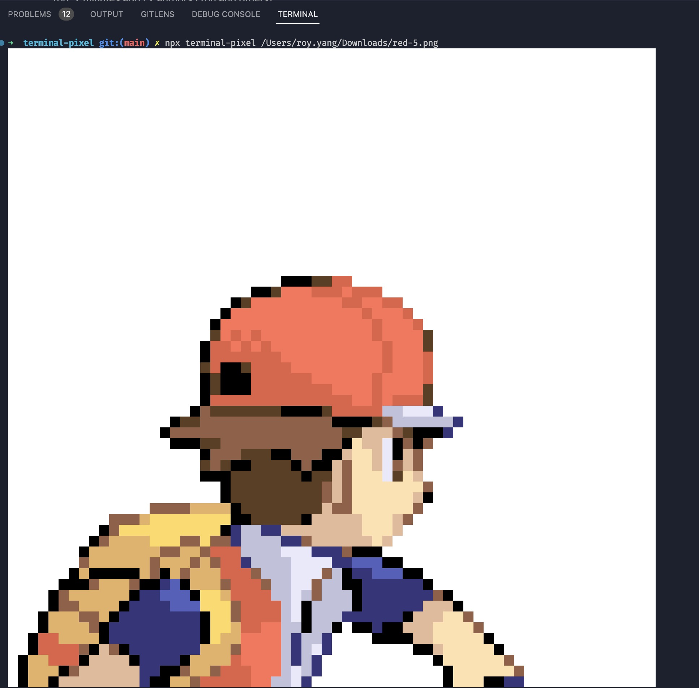

# terminal-pixel

Render Pixel in Your Terminal

<p>
  
</p>
<p>
    <a href="https://www.npmjs.com/package/terminal-pixel"></a>
    <a href="https://www.npmjs.com/package/terminal-pixel"></a>
    <a href="https://github.com/shiyangzhaoa/terminal-pixel/blob/main/LICENSE"></a>
</p>

## Example

<p>
  
</p>

## Install

```shell
npm install terminal-pixel -g
```

## How to use

```shell
terminal-pixel xxx.png
// or npx terminal-pixel xxx.png
```

## Options

### Size

```shell
terminal-pixel xxx.png -s 40
// render size: 40 * 40
```

### Width

```shell
terminal-pixel xxx.png -w 40
// render size: 40 * image.height
```

### Height

```shell
terminal-pixel xxx.png -h 40
// render size: image.width * 40
```
