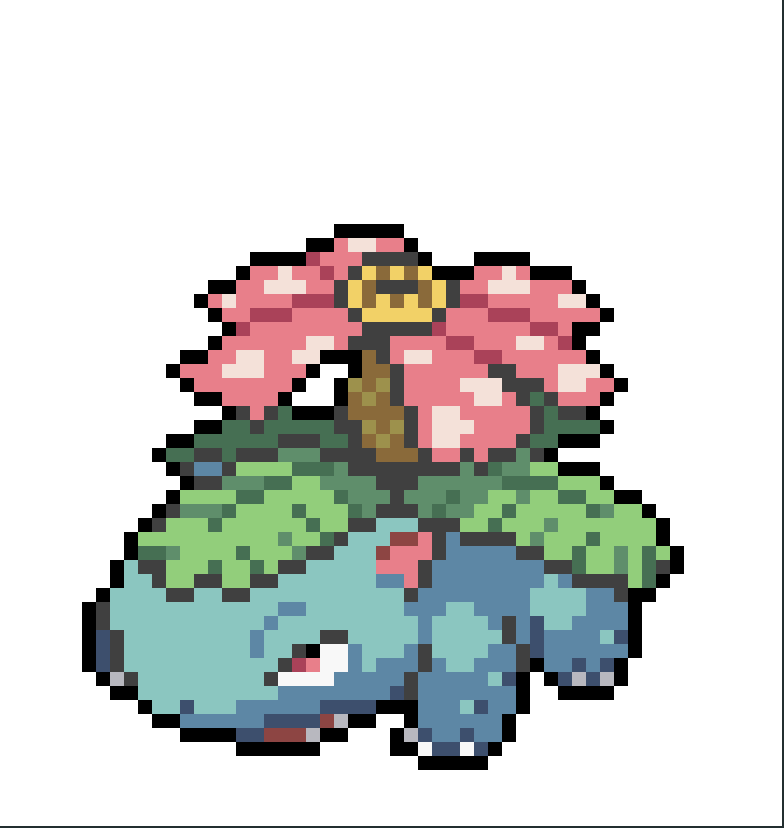

# terminal-pixel

Render Pixel in Your Terminal

<p>
  
</p>
<p>
    <a href="https://www.npmjs.com/package/terminal-pixel"></a>
    <a href="https://www.npmjs.com/package/terminal-pixel"></a>
    <a href="https://github.com/shiyangzhaoa/terminal-pixel/blob/main/LICENSE"></a>
</p>

## Example

<p>
  
</p>

## Install

```shell
npm install terminal-pixel -g
```

## How to use

```shell
terminal-pixel
// or npx terminal-pixel
```

```
> Pixel Center
  Game Center
/Users/xx/bad-apple.mp4

--------------or--------------

  Pixel Center
> Game Center

> snake

Use the 'esc' key to exit the game
```

## Pixel center

1. Render image in your terminal
2. Render video in your terminal(You need to download [ffmpeg](https://ffmpeg.org/download.html))

## Game center

1. Snake
